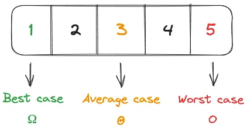

# 
Understanding Big O Notation

---

## What are Asymptotic Notations?
Asymptotic notations are a set of mathematical symbols used to describe the rate of growth of a function. In computer science, they are used to describe the time complexity and space complexity of algorithms and data structures.

### Types of Data Structure Asymptotic Notation

1. Big-O Notation (Ο) – Omicron (Big O) notation specifically describes worst case scenario.
2. Omega Notation (Ω) – Omega(Ω) notation specifically describes best case scenario.
3. Theta Notation (θ) – This notation represents the average complexity of an algorithm.

### How are asymptotic notations used in data structures?
Asymptotic notations are used to analyze the time and space complexity of operations on data structures. For example, let’s consider the time complexity of some common operations on arrays and linked lists:

#### Arrays
- Accessing an element by index: O(1)
S- earching for an element: O(n)
- Inserting an element at the end: O(1)
- Inserting an element in the middle: O(n)
- Deleting an element from the end: O(1)
- Deleting an element from the middle: O(n)

#### Linked Lists
- Accessing an element by index: O(n)
- Searching for an element: O(n)
- Inserting an element at the end: O(1)
- Inserting an element in the middle: O(1)
- Deleting an element from the end: O(n)
- Deleting an element from the middle: O(1)

---
## Introduction to Big O Notation
When analyzing the efficiency of algorithms, it’s crucial to understand how well they scale with larger input sizes. That’s where Big O Notation comes into play. Big O Notation provides a way to express an algorithm’s time complexity, allowing us to compare different algorithms based on how they perform as inputs grow.

### What is Big O Notation?

**Big O** is a notation that allows us to evaluate this, specifically it allows us to evaluate growth rates by analyzing how **time complexity** (Time of execution) and **space complexity** (memory usage) scale for a given algorithm when larger input sizes are processed by it. Big O is driven by the upper bound or higher complexity found in an algorithm so the worst case complexity will be the Big O representation of your code.

### Why Big O Notation?
Imagine you have two algorithms that perform the same task, but one is noticeably faster than the other for large inputs. **Big O Notation** helps us understand why. It gives us a mathematical way to analyze an algorithm’s performance by focusing on the most significant factors that impact execution time. Rather than focusing on exact execution time, Big O looks at *how* performance scales as inputs grow.

### Key Terms to Know
- **n**: Input size
- **Time Complexity**: Measures how the time needed by an algorithm grows as the input size increases
- **Space Complexity**: Measures how much memory an algorithm requires relative to the input size

### Why Is Big O Important?
Big O Notation helps us:
- **Predict Performance**: By analyzing time complexity, we can predict how well an algorithm will perform as input size increases
- **Make Informed Choices**: Understanding complexity allows us to choose algorithms that balance performance with resource constraints
- **Optimize Code**: Big O encourages us to think about efficiency when coding, often leading to more efficient solutions.

### Tips for Improving Algorithm Efficiency
- **Choose Appropriate Data Structures**: Selecting efficient data structures like dictionaries and sets can significantly improve performance
- **Minimize Nested Loops**: Avoid unnecessary nested loops, as they often lead to O(n^2) complexity
- **Consider Recursive Alternatives**: Recursive solutions can sometimes improve readability and performance for complex problems

### Common Types of Complexity
**O(1) — Constant Complexity:** Regardless of the problem size, the algorithm always takes approximately the same amount of time to execute. For example, searching for an element in a sorted list where you can go directly to the desired position is an operation of constant complexity.

**O(log n) — Logarithmic Complexity:** The execution time increases more slowly as the issue size grows. It’s like finding a number in a sorted list by repeatedly halving it, as in binary search.

**O(n) — Linear Complexity:** The execution time grows in proportion to the issue size. For example, traversing a shopping list once to find an item is an operation of linear complexity.

**O(n log n) — Linearithmic Complexity:** Found in efficient sorting algorithms like merge sort and quick sort. As the difficulty size increases, the execution time grows, but not as quickly as quadratic complexities.

**O(n²) — Quadratic Complexity:** Common in algorithms with nested loops. As the concern size increases, the execution time grows rapidly. Imagine a two-dimensional array where you need to check every pair of elements.

**O(n³) — Cubic Complexity:** A step beyond quadratic complexity. As the issue size increases, the execution time increases even faster. This occurs in algorithms with three nested loops, such as those involving three-dimensional arrays.

**O(2^n) — Exponential Complexity:** Algorithms become extremely slow as the difficulty size increases. They are inefficient for large inputs, as the execution time grows exponentially. It can be compared to a time explosion.

**O(n!) — Factorial Complexity:** This is one of the slowest complexities. Factorial algorithms have an execution time that grows even faster than exponential ones. They are mainly used in permutation and combinatorial issues. The larger the input, the slower they become.

### How to calculate Big O notation time complexity?
Here is the procedure to calculate Big-O in your algorithms.

#### Rule 1: Consider the Worst Case
Before we start calculating Big-O, we must assume the worst scenario that could happen in an algorithm. Because in the least ideal situation, the algorithm would take more time and run more slowly.

#### Rule 2: Drop the Constants
The very first step you have to do when calculating Big-O is drop any constants. In the example below, we have two loops which iterate through the length of items. Each loop runs separately in linear time. We are going to add them together, and it gives you O(2n). In here, 2 is a constant, so it can be thrown out. Therefore, it will be O(n) eventually.

#### Rule 3: Different terms for inputs
In case of passing different type of inputs to your algorithm, you need to calculate Big-O individually like the example below. It has two loops that work in the same way, but we pass the different type of input to each loop. So, the first loop is O(n), and the other loop is O(m). We are going to add them together and it will be O(n + m) in here.

#### Rule 4: Drop Non Dominants
Big-O is also not concerned non dominant terms, so you can break it down and just keep the most dominant one in the notation as well as another example below. In this case, the Big-O of this function would be O(n + n²), and you can drop non-dominant term, which is (n) here. In the end, this gives you O(n²).

## Big-O Complexity Cheat Sheet

## Big-O Complexities
The chart below depicts the Big-O complexities mentioned above and the number of elements in the input against the number of operations. The color coding provides a rough judgement on their performance.

A number of very common order of magnitude functions will come up over and over as you study algorithms. The table below shows just how big of a difference the number of computations between these-alogorithms are for 10, 100, and 1000 input elements:

| TERM         | BIG O NOTATION | COMPUTATIONS FOR 10 ELEMENTS | COMPUTATIONS FOR 100 ELEMENTS | COMPUTATIONS FOR 1000 ELEMENTS |
|--------------|:--------------:|-----------------------------:|------------------------------:|-------------------------------:|
| Constant     |  O(1)          |                            1 |                             1 |                              1 |
| Logarithmic  |  O(log n)      |                            3 |                             7 |                             10 |
| Linear       |  O(n)          |                           10 |                           100 |                           1000 |
| Linearithmic |  O(n log n)    |                           33 |                           664 |                           9966 |
| Quadratic    |  O(n^2)        |                          100 |                         10000 |                        1000000 |
| Exponential  |  O(2^n)        |                         1024 |                   1.26765E+30 |                    1.0715E+301 |
| Factorial    |  O(n!)         |                      3628800 |                   9.3326E+157 |                4.0238726E+2567 |

Simply put, `O(1)` stands for constant time complexity, which is the most efficient, while `O(n!)` stands for factorial time complexity, which is the least efficient. The `n` in the complexity represents the size of the input, so `O(n)` means that the algorithm's time complexity will grow linearly with the size of the input.

Apart from Big-O notation, there are other notations that are used to describe the complexity of an algorithm, such as `Ω` (Omega) and `Θ` (Theta). `Ω` describes the best-case complexity of an algorithm, while `Θ` describes the average-case complexity of an algorithm.

## References
- [Big O Notation: The Speedometer for Algorithm Efficiency](https://genezeiniss.medium.com/big-o-notation-the-speedometer-for-algorithm-efficiency-4c8a56bf684e)
- [Four Rules for Big O](https://dev.to/coderjay06/four-rules-for-big-o-1915)
- [Big-Oh or Big O notation with Java examples](https://jsession4d.com/big-oh-or-big-o-notation-with-java-examples/)
- [Big O Notation: Full Overview and Application in Java](https://medium.com/@YodgorbekKomilo/big-o-notation-full-overview-and-application-in-java-2addc218e3d6)
- [Big (O) Notation Explanation](https://javachallengers.com/big-o-notation-explanation/)
- [Introduction To Time Complexity in Programming: Big-O Notation](https://medium.com/codex/introduction-to-time-complexity-in-programming-big-o-notation-c44780c65739)
- [Big O Notation: Time and Space Complexity](https://medium.com/@chanakaanuruddha/big-o-notation-time-and-space-complexity-dfdb9d834fa4)
- [A Simple Explanation of Big O Notation with Examples](https://medium.com/@truongbui95/a-simple-explanation-of-big-o-notation-with-examples-e98b2c2fefa8)
- [Algorithm Analysis — Big O Notation](https://medium.com/java-vault/algorithm-analysis-big-o-notation-13a5c7453f08)
- [Understanding Big-O notation](https://www.coengoedegebure.com/understanding-big-o-notation/)
- [Big O Cheatsheet](https://www.hackerearth.com/practice/notes/big-o-cheatsheet-series-data-structures-and-algorithms-with-thier-complexities-1/)
- [Big O complexity Chart](https://www.amitshahi.dev/blog/2019-06-23-big-o-notation/)
- [Know thy Complexities](https://www.bigocheatsheet.com/)
- [Understanding Big O Notation via JavaScript](https://www.digitalocean.com/community/tutorials/js-big-o-notation)
- [What is Big O Notation Explained: Space and Time Complexity](https://www.freecodecamp.org/news/big-o-notation-why-it-matters-and-why-it-doesnt-1674cfa8a23c/)
- [Common Data Structure operations](https://www.30secondsofcode.org/js/s/big-o-cheatsheet/)
- [Big o Cheatsheet - Data structures and Algorithms with thier complexities](https://www.hackerearth.com/practice/notes/big-o-cheatsheet-series-data-structures-and-algorithms-with-thier-complexities-1/)
- [Big O Complexity Cheatsheet](https://bitsflow.org/algorithms/big-o-complexities/)
- [Ultimate Guide to Big O Notation in 2023](https://fueler.io/blog/guide-to-big-o-notation-and-comprehensive-cheatsheet)
- [30 Common Big-O Notation Interview Questions](https://github.com/Devinterview-io/big-o-notation-interview-questions)
