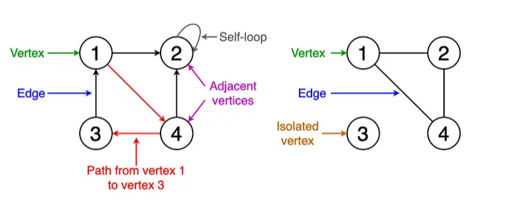

# <p align="center"> Graph </p>
---

## What is Graph?
***Graph** is a Non-Linear type of data structure which is a collection of (V,E) where V stands for vertices and E stands for edges. ***A graph data structure consists of a finite (and possibly mutable) set of vertices or nodes or points, together with a set of unordered pairs of these vertices for an undirected graph or a set of ordered pairs for a directed graph.*** Even tree is a special kind of graph.*

In Mathematical terms, a Graph can be represented by below definition,
A graph G is an ordered pair of set **V** of vertices and set **E** of edges. i.e **G = (V, E)** Since it is an ordered pair, so sequence of items matter.

#### Ordered Pair v/s UnOrdered Pair
* **Ordered Pair:** A pair in which order matters and changing the order is not allowed is called an ordered pair. ex. (a, b) != (b, a) if a != b
* **UnOrdered Pair:** A pair in which order doesn't matter is called an unordered pair. ex. {a, b} = {b, a}

<p align="center"></p>

We have 6 vertices defined here and 9 edges, which can be represented as below,
* **V** = {V0, V1, V2, V3, V4, V5}
* **E** = {{V0, V4}, {V0, V5}, {V3, V5} ...}

---
## Types of graphs
### Directed and Undirected Graphs
<p align="center"></p>

#### Diracted Graphs
A directed edge can be represented using an ordered pair. For the above example, the ordered edge can be represented as *(U, V)*, where the first element is the origin/source and the second element is the destination. For the ordered pair *(U, V)* we have a path from U to V. **However, we do not have a path from V to U**.

*A directed graph may or may not have cycles*, this depends on the direction of the edges. A directed graph having no cycles is usually called a DAG (Directed Acyclic Graph).

**Some standard algorithms that work on directed graphs**
* DFS (Depth-First Search)
* Topological Sorting
* Dijkstra's Algorithm for finding the shortes path
* Bellman-Ford Algorithm for finding the shortest path with negative weights 

#### Undirected Graphs
For undirected edges, the path is 2-way (bidirectional). Undirected edges are represented by unordered pairs _{U, V}_.

*An undirected graph always has cycles*. Just with two nodes and an edge connecting them, a cycle can be formed (go from first node to the second, then back to first, then back to second, and so on)

**Some standard algorithms that work on directed graphs**
* DFS (Depth-First Search)
* BFS (Breadth-First Search)
* Kruskal's Algorithm for finding minimum spanning trees

### Weighted and Unweighted Graphs
<p align="center"></p>

#### Weighted Graphs
Graphs whose edges or paths have values. All the values seen associated with the edges are called weights. Edges value can represent weight/cost/length.
Values or weights may also represent:
* Distance covered between two points- Ex: To look for that shortest path to the office, the distance between two workstations in an office network.
* Speed of the data packet in a network or bandwidth.

### Cyclic and Acyclic Graphs
<p align="center"></p>

#### Cyclic Graphs
A cyclic graph contains at least one cycle, which is a path that starts and ends at the same vertex. In other words, there is a sequence of edges that leads you back to where you started.

Cyclic graphs are commonly used to represent systems with feedback loops, such as control systems or social networks. They can also be used to model processes that repeat themselves over time, such as the seasons of the year or the phases of the moon.

### Acyclic Graph
Acyclic graphs, also known as directed acyclic graphs (DAGs), are used in many areas of computer science and mathematics. They are particularly useful in representing dependencies between tasks or events, such as in project management or scheduling problems. They are also used in machine learning and artificial intelligence, for example, in Bayesian networks, which represent probabilistic relationships between variables.

### Connected, Disconnected and Complete Graphs
<p align="center"></p>

---
## Graph Terminologies

<p align="center"></p>

* **Vertices (Nodes):** These are the fundamental units of a graph, representing the entities or objects being modeled. A vertex is denoted by **`V`** and represented by the circle.
* **Edges (Links):** Edges are the connections between vertices, representing the relationships or associations between entities. It is denoted by **`E`** and represented by a straight line.
   * **Directed Edge:** Unidirectional edge between the vertices is called directed edges. If a directed edge exists in between A->B then there is a path from A to B but not From B to A.
   * **Undirected Edge:** Bidirectional Edge between the vertices is called undirected edges. If an undirected edge exists in between A-B then there is a path from A to B and B to A.
   * **Weighted Edge:** An edge that contains the weight or cost on it
* **Adjacent (Neighbor)**: In a graph, two vertices (nodes) are considered adjacent if they are directly connected by an edge, indicating an immediate relationship or link between them.
* **Degree:** The degree of a vertex is the number of edges connected to it. In a directed graph, vertices have an in-degree (number of incoming edges) and an out-degree (number of outgoing edges).
   * **In-degree** is a count of incoming edges in the directed Graph that are connected to Vertex V.
   * **Out-degree** is a count of outgoing edges in the directed Graph that are connected to Vertex V.
* **Path:** A path is a sequence of vertices connected by edges, allowing you to traverse from one vertex to another.
* **Self-loop:** A self-loop is an edge that connects a vertex to itself. This represents a scenario where an entity is associated with or relates back to itself within the graph’s context.
* **Cycle:** A cycle is a path that starts and ends at the same vertex, forming a closed loop.
* **Parallel:** are those edges that are connected through the same pair of vertexes
* **Isolated vertex:** A vertex in the graph that is not related to any other vertex.
---
## Graph Representations
Representing graphs mathematically is essential for efficient algorithm development and analysis. We’ll delve into two primary methods of representing graphs:
* Adjacency Matrix
* Incidence Matrix
* Adjacency List

### Adjacency Matrix
Adjacency Matrix is a square matrix used to represent graphs having a finite number of nodes. It represents the adjacent nodes to each other. We have to construct a `n x n` matrix, if a node is connected to another node then `M[i][j] = 1` else `M[i][j] = 0`.

**>>> For example, consider the following undirected graph representation...**
<p align="center"></p>

**>>> Directed graph representation...**
<p align="center"></p>

#### Advantages:
* It is easy to check which nodes are connected other one and which node is not connected.
* Adjacency Matrices are easy to implement and follow.

#### Disadvantages:
* It requires a large memory complexity.
* It is helpful only when the number of nodes are less.

```java
import java.util.*;

class Graph {
    private int vertices; // Number of vertices in the graph
    private int[][] adjMatrix; // 2D array to represent the adjacency matrix

    public Graph(int vertices) {
        this.vertices = vertices;
        // Initialize the adjacency matrix with zeros, indicating no edges.
        adjMatrix = new int[vertices][vertices];
    }

    public void addEdge(int source, int destination) {
        // Add an edge from source to destination.
        adjMatrix[source][destination] = 1;

        // Since it's an undirected graph, also add an edge from destination to source.
        adjMatrix[destination][source] = 1;
    }

    public void printGraph() {
        for (int i = 0; i < vertices; i++) {
            // Print each row of the adjacency matrix.
            System.out.println(Arrays.toString(adjMatrix[i]));
        }
    }
}

public class Main {
    public static void main(String[] args) {
        // Creating a graph with 5 vertices.
        Graph graph = new Graph(5);

        // Adding edges to the graph.
        graph.addEdge(0, 1); // Edge between vertex 0 and 1
        graph.addEdge(0, 4); // Edge between vertex 0 and 4
        graph.addEdge(1, 2); // Edge between vertex 1 and 2
        graph.addEdge(1, 3); // Edge between vertex 1 and 3
        graph.addEdge(1, 4); // Edge between vertex 1 and 4
        graph.addEdge(2, 3); // Edge between vertex 2 and 3
        graph.addEdge(3, 4); // Edge between vertex 3 and 4

        // Displaying the adjacency matrix of the graph.
        System.out.println("Adjacency Matrix:");
        graph.printGraph();
    }
}
```
### Incidence Matrix
Incidence Matrix is represented by constructing a matrix of size `(v x e)`, the number of vertices is represented by rows and the number of edges is represented by columns. This matrix can be square or rectangle.
* `M[i][j] = 0` represents that the row edge is _not connected_ to column vertex 
* `M[i][j] = 1` represents that the row edge is connected as the _outgoing edge_ to column vertex 
* `M[i][j] = -1` represents that the row edge is connected as the _incoming edge_ to column vertex

**>>> For example, consider the following directed graph representation...**
<p align="center"></p>

#### Advantages:
* No advance structure is needed to represent the graph.
* This representation is easy to understand and implement.
### Disadvantages:
* Consumes a large amount of space

### Adjacency List
An adjacency list is a collection of lists or arrays, where each list represents a node and contains the nodes it’s directly connected to.
For each node `i` create a list that contains its neighbors (nodes connected to `i`)

**>>> For example, consider the following directed graph representation implemented using linked list...**
<p align="center"></p>

#### Advantages:
* It saves a lot of memory in the system.
* Insertion and deletion of nodes are easy in the Adjacency List.
*It is easy to follow and easy to read.
* Allow us to compactly represent the graph.

#### Disadvantages:
* Adjacency lists are useful when there is a large graph, but when the graph is small, a lot of memory space is required to represent the graph.

```java
import java.util.*;

class Edge<E> {
    private E source;
    private E destination;
    private double weight;

    public Edge(E source, E destination) {
        this.source = source;
        this.destination = destination;
    }

    public Edge(E source, E destination, double weight) {
        this.source = source;
        this.destination = destination;
        this.weight = weight;
    }

    public E getSource() {
        return source;
    }

    public E getDestination() {
        return destination;
    }

    public double getWeight() {
        return weight;
    }

    @Override
    public String toString() {
        return String.format("(%s -> %s, %.2f)", source, destination, weight);
    }
}

public class Graph<E> {
    private Map<E, List<Edge<E>>> adjacencyList;
    private boolean isDirected;

    public Graph() {
        this.adjacencyList = new HashMap<>();
    }

    public Graph(boolean isDirected) {
        this.isDirected = isDirected;
        this.adjacencyList = new HashMap<>();
    }

    public void addVertex(E vertex) {
        adjacencyList.putIfAbsent(vertex, new ArrayList<>());
    }

    public void add(E source, E destination) {
        addVertex(source);
        addVertex(destination);
        adjacencyList.get(source).add(new Edge<>(source, destination));

        if (!isDirected) {
            adjacencyList.get(destination).add(new Edge<>(destination, source));
        }
    }

    public void add(E source, E destination, double weight) {
        addVertex(source);
        addVertex(destination);
        adjacencyList.get(source).add(new Edge<>(source, destination, weight));

        if (!isDirected) {
            adjacencyList.get(destination).add(new Edge<>(destination, source, weight));
        }
    }

    public String toString() {
        StringBuilder sb = new StringBuilder();
        for (E vertex : adjacencyList.keySet()) {
            sb.append(vertex).append(" -> ");
            for (Edge<E> edge : adjacencyList.get(vertex)) {
                sb.append(edge).append(" ");
            }
            sb.append("\n");
        }
        return sb.toString();
    }
}
```

---
## Graph Traversals
Now that we understand the basic structure of a graph, let’s dive into the theory behind graph traversal algorithms. Graph traversal involves visiting all the vertices in a graph in a systematic way. The two most common traversal algorithms are **Breadth-First Search (BFS)** and **Depth-First Search (DFS)**
### Breadth-First Search (BFS)
Breadth-First Search (BFS) is a traversal algorithm that explores all the vertices at the current depth level before moving on to the vertices at the next level. It’s ideal for scenarios where we need to explore all neighbors first before diving deeper into the graph.
#### Theory Behind BFS:
1. BFS starts at a selected **start vertex**
2. It then visits all the neighboring vertices at the current level before moving to the next level
3. BFS uses a **queue** data structure to keep track of vertices to visit
```java
public void bfs(int start) {
  Queue<Integer> queue = new LinkedList<>();
  Set<Integer> visited = new HashSet<>();

  queue.add(start);
  visited.add(start);

  while (!queue.isEmpty()) {
    int vertex = queue.poll();
    System.out.println(vertex + " ");

    for (int neighbor : adjList.get(vertex)) {
      if (!visited.contains(neighbor)) {
        visited.add(neighbor);
        queue.add(neighbor);
      }
    }
  }
}
```
In this implementation, BFS begins by adding the starting vertex to a queue. It then explores each vertex and adds its unvisited neighbors to the queue, ensuring that each vertex is visited only once
### Depth-First Search (DFS)
Depth-First Search (DFS) is another popular graph traversal method. Unlike BFS, DFS explores as deeply as possible along each branch before backtracking to explore other paths. This traversal can be implemented using either recursion or a stack.
#### Theory Behind DFS:
1. DFS starts at a selected **start vertex**
2. It recursively visits each neighboring vertex before backtracking
3. DFS is often implemented using recursion, but it can also be implemented with an explicit **stack**.
```python
def dfs(self, start_vertex: any):
    visited = set()
    self._dfs_recursive(start_vertex, visited)

def _dfs_recursive(self, start_vertex: any, visited: set):
    if start_vertex not in visited:
        print(start_vertex, end=" ")
        visited.add(start_vertex)
        for neighbor in self.adj_list[start_vertex]:
            self._dfs_recursive(neighbor, visited)
```
In this recursive implementation, the `_dfs_recursive` method explores each neighbor of the current vertex. If a neighbor hasn’t been visited yet, the function calls itself to explore deeper into the graph

### When to use Breadth-First vs Depth-First in Graphs?
The choice between Breadth-First and Depth-First depends on the specific problem and the desired behavior. Breadth-First is useful for finding the shortest path between two vertices in an unweighted graph, while Depth-First is useful for topological sorting, detecting cycles, and exploring deeply nested structures

## Practical Applications of Graph Traversals
Graph traversal algorithms, such as BFS and DFS, are widely used in various applications. For example:
* Social Networks: BFS is used to find the shortest path between two users
* Search Engines: DFS is often used in crawling the web to explore links between pages
* Pathfinding Algorithms: BFS and DFS are both used in different types of pathfinding algorithms to find the most efficient route between two locations

## Common Graph Algorithm
* **Shortest Path Algorithms:** Dijkstra’s algorithm and Bellman-Ford's algorithm are commonly used to find the shortest path between two nodes in a weighted graph.
* **Minimum Spanning Tree:** Prim’s algorithm and Kruskal’s algorithm are used to find the minimum spanning tree in a weighted graph.
* **Topological Sorting**: Topological sorting is used to order the nodes in a directed acyclic graph based on their dependencies.

## References
- [Best Implement Graph using Java](https://gitlab2.educ.di.unito.it/st224675/algoritmi-e-strutture-dati/-/blob/a71051ec954f5a218492aa4d578d9d44d4991643/Ex3-4/Graph.java)
- [Simple-Graph-Implementation](https://github.com/Satshabad/Simple-Graph-Implementation/blob/master/src/Graph.java)
- [Graph](https://github.com/vinodpal/Graph/blob/master/src/main/java/Graph/StronglyConnectedComponent/SpecialWalk.java)
- [19. DSA — Adjacency List](https://medium.com/@rrizaei/19-dsa-adjacency-list-18de1f73368e)
- [Data Structures and Algorithms: A Simple Guide — Graphs](https://medium.com/@sumedhaj97/data-structure-and-algorithms-a-simple-guide-graphs-737c4f893d9d)
- [Types of Graphs and their Representations in Java](https://siddosamith.medium.com/types-of-graphs-and-their-representations-in-java-b04f982714d4)
- [Understanding Graph Data Structures and Their Traversals: A Comprehensive Guide](https://medium.com/codex/understanding-graph-data-structures-and-their-traversals-a-comprehensive-guide-c5f93a3c0f6b)
- [Graphs in Java](https://medium.com/@aqibbutt3078/graphs-in-java-94691259710f)
- [Data Structures Algorithms Cheat Sheet in Python](https://manralai.medium.com/data-structures-algorithms-cheat-sheet-in-python-e87d0e29bd1a)
- [How to implement Graph Data Structure in Java](https://medium.com/@archies.gurav18/how-to-implement-graph-data-structure-in-java-13b497e26e84)
- [Graph — Data Structure](https://medium.com/@alokkumar.light/graph-data-structure-86683b043bfc)
- [Graph](https://medium.com/data-structures-and-algorithms/graph-dd2b72c32f1f)
- [Data Structures: Graphs](https://medium.com/swlh/data-structures-graphs-50a8a032db03)
- [Graphs 101: Understanding Graph Data Structures](https://medium.com/@elfrmkr98/graphs-101-understanding-graph-data-structures-4d8252f26af)
- [Navigating the World of Graph Data Structures: A Comprehensive Guide](https://medium.com/@johnadjanohoun/navigating-the-world-of-graph-data-structures-a-comprehensive-guide-3a2fde633f50)
- [Computational Concepts: An Introduction to Graph Data Structures](https://medium.com/@dowaj/computational-concepts-an-introduction-to-graph-data-structures-8b3a66c384ac)
- [Graphs Data Structures: Understanding Utility and Use Cases with sample code in Python](https://medium.com/@siladityaghosh/graphs-data-structures-understanding-utility-and-use-cases-with-sample-code-in-python-d32615321235)
- [An Introduction To Graph Data Structure](https://medium.com/@arjunblog009/an-introduction-to-graph-data-structure-9929eb5808d2)
- [Understanding Graph Data Structures and Their Traversals: A Comprehensive Guide](https://medium.com/codex/understanding-graph-data-structures-and-their-traversals-a-comprehensive-guide-c5f93a3c0f6b)
- [ Implementing Graphs: Edge List, Adjacency List, Adjacency Matrix](https://algodaily.com/lessons/implementing-graphs-edge-list-adjacency-list-adjacency-matrix/java)
- [Java Graph (Directed and weighted), simple and fast](https://medium.com/binary-maths/java-graph-directed-and-weighted-simple-and-fast-10cf832255c4)
- [Graph Traversals in Java DFS & BFS](https://siddosamith.medium.com/graph-traversals-in-java-dfs-bfs-a91910f6b9f9)
- [Mastering Graph Traversal: Implementing DFS and BFS in Java](https://medium.com/@YodgorbekKomilo/mastering-graph-traversal-implementing-dfs-and-bfs-in-java-c466c036fbd1)
- [Introduction to Graph Algorithms in Java — A Brief Beginner’s Overview](https://medium.com/@AlexanderObregon/introduction-to-graph-algorithms-in-java-a-beginners-guide-450cace790d4)
- [Demystifying Graph Implementation in Programming: A Comprehensive Guide](https://medium.com/@MakeComputerScienceGreatAgain/demystifying-graph-implementation-in-programming-a-comprehensive-guide-b856712b2b1c)
- [Constructing and Representing an Undirected Graph Using Adjacency Lists in Java](https://medium.com/@ilakk2023/332-constructing-and-representing-an-undirected-graph-using-adjacency-lists-in-java-5d6f2febd9a3)
- [Graph Algorithms — Part 1](https://medium.com/analytics-vidhya/graph-algorithms-1-5d80d022019)
- [Creating a Graph in Java](https://medium.com/@avinash.sarguru/creating-a-graph-in-java-fdefa5b0a83f)
- [Basic Graph Implementation in Java](https://medium.com/@mithratalluri/basic-graph-implementation-in-java-9ed12e328c57)
- [Graph Algorithms](https://www.geeksforgeeks.org/graph-data-structure-and-algorithms/)
- [Understanding Data Structures and Algorithms](https://medium.com/@Adekola_Olawale/understanding-data-structures-and-algorithms-758f86a7196d)
- [7 JavaScript Data Structures you must know](https://dev.to/nehasoni__/7-javascript-data-structures-you-must-know-57ah)
- [How I Mastered Data Structures and Algorithms](https://blog.algomaster.io/p/how-i-mastered-data-structures-and-algorithms)
- [Graph Implementation in Python](https://experiencestack.co/graph-implementation-in-python-916fc3b6a8a)
- [Graphs in DSA](https://medium.com/@priyagupta7272/graphs-in-dsa-d5362fe83492)
- [Java Nodes Explained: Essential Building Blocks for Linked Lists, Trees, and Graphs](https://javafullstackdev.medium.com/java-nodes-explained-essential-building-blocks-for-linked-lists-trees-and-graphs-93b1163f922e)
- [Graph — Data Structure](https://medium.com/codex/graph-data-structure-ddbaba50accf)
- [How to Build a Graph Data Structure](https://medium.com/outco/how-to-build-a-graph-data-structure-d779d822f9b4)
- [Graph Data structure](https://medium.com/@roshanku2942/graph-data-structure-d590a2920405)
- [Data Structures: Understanding Graphs](https://javascript.plainenglish.io/data-structures-understanding-graphs-82509d35e6b5)
- [GRAPHS IN JAVA (PART 1)](https://medium.com/@mauryaishika100/graphs-in-java-part-1-51759e742548)
- [Everything about Graph Data Structure : An Overview](https://medium.com/javarevisited/everything-about-graph-data-structure-an-overview-83b74358bad0)
- [Graph — Data Structure](https://medium.com/@alokkumar.light/graph-data-structure-86683b043bfc)
- [Graph](https://medium.com/data-structures-and-algorithms/graph-dd2b72c32f1f)
- [DSA12# How to implement a Graph (Adjacency List and Matrix) in JavaScript](https://mariusniemet20.medium.com/dsa12-how-to-implement-a-graph-adjacency-list-and-matrix-in-javascript-51ab7a099a77)
- [Getting Started With Graphs](https://medium.com/swlh/getting-started-with-graphs-2befaa509fc5)
- [Graph Data Structure Representation — Adjacency List](https://medium.com/@arjunblog009/graph-data-structure-representation-adjacency-list-5409bc0d2b05)
- [Graph Data Structure: Exploring Adjacency List and Adjacency Matrix (DFS and BFS)](https://medium.com/@ajithr116/graph-data-structure-exploring-adjacency-list-and-adjacency-matrix-dfs-and-bf-d14bed493490)
- [From Theory To Practice: Representing Graphs](https://medium.com/basecs/from-theory-to-practice-representing-graphs-cfd782c5be38)
- [Graph and its representations](https://stephanosterburg.gitbook.io/scrapbook/coding/python/graph-and-its-representations)
- [Java Graph Tutorial – How To Implement Graph Data Structure](https://www.softwaretestinghelp.com/java-graph-tutorial/)
- [Graph Data Structures in Java](https://labex.io/tutorials/java-graph-data-structures-in-java-117410)
- [Graph Data Structure with Java](https://javachallengers.com/graph-data-structure-with-java/)
- [Directed Graph Initialization](https://stackoverflow.com/questions/43507283/directed-graph-initialization/43508282)
- [Graph.java](https://gist.github.com/allen1881996/0a924c51d9bb4b9d7077e062794e2b3a)
- [Graphs Java Example](https://javatutorial.net/graphs-java-example/)
- [Exploring Graph Data Structure with Golang](https://towardsdev.com/exploring-graph-data-structure-with-golang-bedb0c7b983b)
- [Graph Theory: The Human Explanation](https://blog.stackademic.com/graph-theory-the-human-explanation-9611879221f4)
- [Graph storage technique](https://medium.com/@siddarthsiddhu58/graph-storage-technique-7d32861956f0)
- [Graph-Theoretic Algorithms](https://medium.com/@athrav.kale20/graph-theoretic-algorithms-81fc5291460e)
- [Graph Data Structure](https://teachics.org/data-structure-c-tutorial/graph-representation-types-application/)
- [Graph data structure](https://meetjainblogs.hashnode.dev/graph-data-structure)

* **Traveral**
* [Mastering Graph Traversal: Implementing DFS and BFS in Java](https://medium.com/@YodgorbekKomilo/mastering-graph-traversal-implementing-dfs-and-bfs-in-java-c466c036fbd1)
* [Breadth-First Search (BFS) and Depth-First Search (DFS): Traversal Techniques in Graphs](https://medium.com/@chaudharyritesh947/breadth-first-search-bfs-level-order-traversal-in-graphs-d283f9d4e174)
* [Computational Concepts: Breadth-First And Depth-First Graph Search Algorithms](https://medium.com/@dowaj/computational-concepts-breadth-first-and-depth-first-graph-search-algorithms-b63f28000406)
* [Breadth First Search (in java)](https://medium.com/geekculture/breadth-first-search-in-java-d32d29f6bb9e)
* [Graph Traversals in Java DFS & BFS](https://siddosamith.medium.com/graph-traversals-in-java-dfs-bfs-a91910f6b9f9)
* [Graph](https://medium.com/@sujangyawali177/graph-6408bd1c395b)
* [Detecting Cycle in an undirected Graph using BFS in Java](https://siddosamith.medium.com/detecting-cycle-in-an-undirected-graph-using-bfs-in-java-94441d78bc21)

