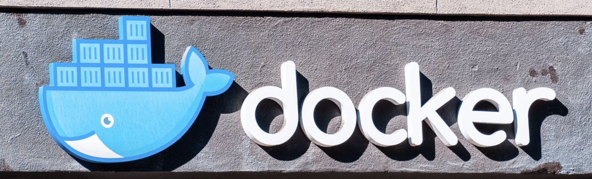
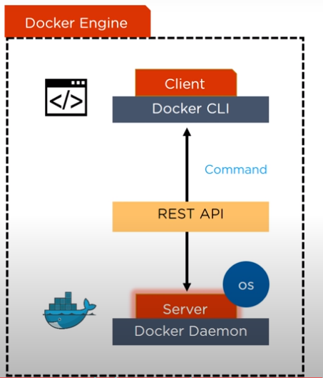
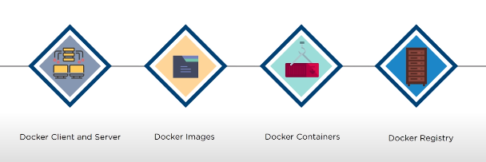
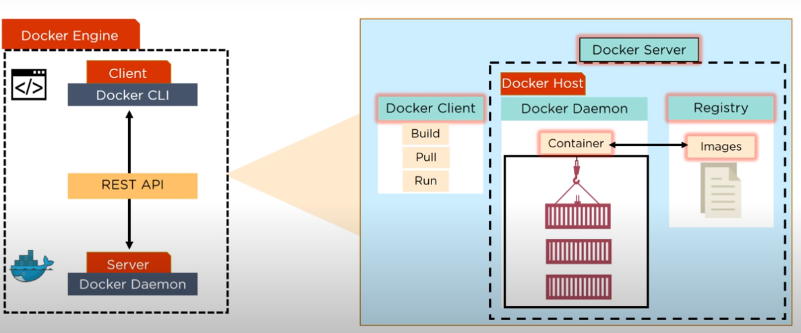
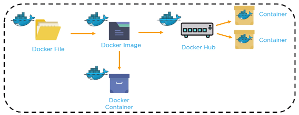

<!-- # <p align="center">Docker for Beginner</p> -->

<!-- <div align="center"></div> -->

<div align="center"></div>

---

## Table of Contents

- [What is Docker?](#what-is-docker?)
- [How Does Docker Work?](#how-does-docker-works?)
- [How to Install Docker on Arch Linux?](#how-to-install-docker-on-arch-linux?)
---

## What is container?

To summarize, a container:

- is a runnable instance of an image. You can create, start, stop, move, or delete a container using the _DockerAPI_ or _CLI_.
- can be run on local machines, virtual machines or deployed to the cloud.
- is portable (can be run on any operating system)
- 

## What is Docker?

Docker is an open-source software that runs on Linux and Windows. With Docker, you can package your application and its dependencies together into __containers__. Docker allows you to separate your applications from your infrastructure.

The company started as a platform as a service that was built on LInux containers. to help make and manage the containers, they built an in-house tool that they nicknamed `"Docker"`.

## Docker Architecture
Docker architecture consists of several components that work together to facilitate the creation, deployment, and management of containers. These key components include:
1. Docker Engine
2. Docker Images
3. Docker Containers
4. Docker Registries

### Docker Engine
The Docker engine is the most important component of Docker, also responsible for running the containers. A Docker engine consists of:
* **Docker Daemon**: Manages objects like images, containers, networks, and volumes.
* **Docker Client**: The Command line interface (CLI) that helps the user to interact with Docker and its components. Commands like `docker run`, `docker build`, `docker pull`, and `docker push` are sent from the Docker Client to the Docker Daemon.
* **REST API**: Provides a way to communicate with Docker Daemon.

### Docker Images
Docker images are templates used to create containers. These images contain the application along with all the necessary dependencies and packages required for it to run. A Docker image packages everything the application needs into a single, portable unit, ensuring consistency across different environments.

### Docker Containers
Docker containers are instances of a Docker image. They contain the application and its dependencies, providing a constant environment for running the application across different systems. It’s also important to understand the cycle of a Docker container:
* **Create**: A container is created from a Docker image.
* **Start**: The container is started, running the specified command or application.
* **Stop**: The container is stopped, pausing the application.
* **Restart**: The container is restarted.
* **Pause/Unpause**: The container’s processes are paused or resumed.
* **Destroy**: The container is removed from the system.

### Docker Registries
Docker Registries are repositories for storing and distributing Docker images. They allow users to share images within an organization or publicly. The Docker registry is divided into two parts:
* **Docker Hub**: Docker Hub is the default public registry provided by Docker. It hosts a vast collection of official and community-contributed images.
* **Private repositories**: Users can also set up private repositories which can only be accessed by people who have permission to access the repository. Usually, organizations choose this repository to keep their data safe.

## How Does Docker Works?

First, there's the _Docker CLI_, which is what you interact with in your terminal. The CLI sends commands to a _Docker daemon_. This can run locally or on a remote host. The daemon is responsible for managing containers and the images they're created from.

The final component is called the _container runtime_. The runtime invokes kernel features to actually launch containers.

<div align="center"></div>

- Docker Engine or Docker is the base engine installed on your host machine to build and run containers using Docker components and services.
- It uses a client-server architecture
- Docker Client and Server communicate using Rest API

### What happends here?

- Docker Client is a service which runs a command. The command is translated using REST API and is sent to the Docker Daemon (server)
- Then, Docker Daemon checks the client request and interacts with the operating system in order to create or manage containers.

### Components of Docker

<div align="center"></div>

#### Docker client and Server

<div align="center"></div>

- Docker Client is accessed from the terminal and a Docker Host runs the Docker Daemon and Registry
- A user and build Docker Images and run Docker Containers by passing commands from the Docker Client to Docker Server

#### Docker Image

- Docker Image is a template with instructions, which is used for creating Docker Containers
- A Docker image is built using a file called Docker File
- Docker image is stored in a Docker Hub or in a repository (like registry.hub.com)

#### Docker container

- Docker Container is a standalone, executable software package which includes applicaions and their dependencies
- Numerous Docker Containers run on the same infrastructure and share operating system (OS) with its other containers
- Here, each application runs in isolation

#### Docker Registry

- Docker Registry is an open source server-side service used for hosting and distributing images
- Docker alse has its own default registry called Docker Hub
- Here, images cna be stored in either public or private repositories
  - Public repositories can be used to host docker Images which can be used by everyone
  - Private repositories allows a user to store Docker images that he/she wants to keep private
  - In order to build a container, `pull`  command is used to get a Docker image from the Docker repository
- Pull and Push are the commands used by users in order to interact with a Docker Registry
```
docker pull <image>:<tag>:pulls and image from DTR
```

```
docker push <image>:<tag>:pushes and image from DTR
```
#### Docker Recap

<div align="center"></div>

- Docker File crates a Docker Image using the build command
- A Docker image contains all the project's code
- using Docker image, any user can run the code in order to create Docker Containers
- Once a Docker Image is built, it's uploaded in a registry or a Docker Hub
- From Docker Hub, User can get the Docker Image and build new containers

## How to Install Docker on Arch Linux?

## Working on Docker

### Getting Started

You can check that your installation is working by starting a simple container:

``` 
$ docker run hello-word
```

This will start a new container with the basic `hello-word` image. The image emits some output explaining how to use Docker. The container then exits, dropping you back to your terminal.

### Create Your Project

In order to create your first Docker application, I invite you to create a folder on your computer. It must contain the following two files:

- `_main.py_` file (python file that will contain the code to be executed).
- `_Dockerfile_` file (Docker file that will contain the necessary instructions to create the environment) 

```
.
├── Dockerfile
└── main.py
0 directories, 2 files
```

### Edit the Python file

``` py
print("docker is magic!")
```

### Edit the docker file

The first thing to fo whrn you want to create your Dockerfile is to ask yoursel what you want to do. 


``` Dockerfile
# A dockerfile must always start by importing the base image.
# We use the keyword 'FROM' to do that.
# In our example, we want import the python image.
# So we write 'python' for the image name and 'latest' for the version.
FROM python:latest

# In order to launch our python code, we must import it into our image.
# We use the keyword 'COPY' to do that.
# The first parameter 'main.py' is the name of the file on the host.
# The second parameter '/' is the path where to put the file on the image.
# Here we put the file at the image root folder.
COPY main.py /

# We need to define the command to launch when we are going to run the image.
# We use the keyword 'CMD' to do that.
# The following command will execute "python ./main.py".
CMD [ "python", "./main.py" ]
```

### Create the Docker image

Once your code is ready the Dockerfile is written, all you have to do is create your image to contain your application.

```
$ docker build -t python-test
```

The `-t` option allows you to define the name of your image.

### Run the Docker image

Once the image is created, your code is ready to be launched.

```
$ docker run python-test
```

You need to put the name of your image after `docker run`

## CLI references

Refer to the following topics for further documentation on all CLI commands used in this article:

- docker version
- docker run
- docker image
- docker container

## Useful commands for Docker
- Check the available network by running the `docker network ls` command
```
$ docker network ls           
NETWORK ID     NAME      DRIVER    SCOPE
5077a7b25ae6   bridge    bridge    local
7e25f334b07f   host      host      local
475e50be0fe0   none      null      local
```
- List your images
``` 
$ docker image ls
```
- Delete a specific image
```
$ docker image rm [image name]
```
- Delete all existing images
```
$ docker image rm $(docker images -a -q)
```
- List all existing containers (running and not running)
```
$ docker ps -a
```
- Stop a specific container
```
$ docker stop [container name]
```
- Stop all running containers
```
$ docker stop $(docker ps -a -q)
```
- Delete a specific container (only if stopped)
```
$ docker rm [container name]
```
- Delete all containers (only if stopped)
```
$ docker rm $(docker ps -a -q)
```
- Display logs of a container
```
$ docker logs [container name]
```

## References

- [Docker tutorials](https://tecadmin.net/tutorial/docker/docker-tutorials/)
  [Docker Networking](https://earthly.dev/blog/docker-networking/)
- [Docker Tutorial for Beginners](https://data-flair.training/blogs/docker-tutorial/)
