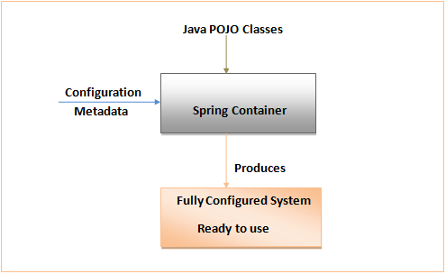

# <p align="center"> A Deep Dive into Spring Boot </p>
---
## Bean in Spring framework
In Spring, the **objects** that form the backbone of your application and that are managed by the **Spring IoC container** are called beans. A bean is an object that is instantiated, assembled, and otherwise managed by a Spring IoC container.

## Introduction: The Early Java Era
In the early era of programming, writing Java code was a bit frustrating. Developers had to set up long configurations, deal with verbose XML files, and manually manage dependencies that were rapidly updated. This era made it harder for developers to thrive and write efficient code.

In 2003, **Spring Framework** revolutionized the Java ecosystem by introducing **Dependency Injection (DI)** and **Inversion of Control (IoC)**. These features significantly reduced developers' headaches by eliminating tightly coupled code and making it easier to write clean, modular code.

<p align="center">
  
**IoC** is a design principle where the control of object creation and dependency management is transferred to a container (like the Spring IoC container). Instead of objects managing their own dependencies, the container does this work for you!

### Normal (Without IoC) Behavior
Without IoC, developers are responsible for creating and managing their object dependencies.

For example, let’s consider a `Car` class that depends on an `Engine` class. In this scenario, the `Car` class manages the `Engine` object by itself:
```java
public class Car {
    private Engine engine = new Engine();  // Car directly creates an Engine

    public void start() {
        engine.run();
    }
}
```
**In this case:**
* The `Car` class **directly creates** the `Engine` object.
* The `Car` class is responsible for both creating and managing the `Engine` object, which creates a **tight coupling** between the two.
* If we want to change the `Engine` class (for example, to use a `HybridEngine`), we’d need to modify the `Car` class. This violates the **Open/Closed Principle**: classes should be **open for extension** but **closed for modification**


## What happens when Spring Boot runs:
* **Application Context Creation:**
`SpringApplication.run()` begins by creating an instance of the Spring `ApplicationContext`, which serves as the central container for managing beans and their lifecycle.
* **Environment Preparation:**
The application's environment is prepared, including loading configuration properties from sources like `application.properties` or `application.yml`.
* **Component Scanning:**
Spring Boot performs a component scan, typically starting from the package of the main application class, to discover and register Spring components (e.g., `@Component`, `@Service`, `@Repository`, `@Controller`, `@Configuration`).
* **Auto-configuration:**
Based on the classpath and defined dependencies, Spring Boot's auto-configuration mechanism automatically configures various aspects of the application, such as setting up a data source if a database driver is present or configuring an embedded web server (e.g., Tomcat, Jetty).
* **Bean Definition Registration:**
Discovered components are registered as `BeanDefinition` objects within the `ApplicationContext`, outlining how each bean should be created and managed.
* **BeanFactoryPostProcessors:**
Any `BeanFactoryPostProcessor` beans are invoked to modify bean definitions before actual bean instantiation.
* **Bean Instantiation and Dependency Injection:**
Beans are instantiated, and their dependencies are injected by the Spring container, following the principles of Inversion of Control (IoC) and Dependency Injection (DI).
* **Embedded Server Startup (for web applications):**
If it's a web application, an embedded web server (like Tomcat by default) is started, listening on a configured port (default 8080).
* **Runners Execution:**
If `ApplicationRunner` or `CommandLineRunner` beans are defined, their `run` methods are executed, allowing for custom logic to be performed after the application context is fully initialized.

## How Spring Boot works behind the scenes
Spring Boot leverages several key mechanisms to achieve its ease of use and rapid development:
* **Convention over Configuration:**
Spring Boot provides sensible defaults and conventions, reducing the need for explicit configuration. For example, by simply adding `spring-boot-starter-web` to the classpath, an embedded Tomcat server is automatically configured.
* **Auto-configuration:**
This core feature analyzes the classpath and existing configurations to automatically configure common components and functionalities, such as database connections, web servers, and security settings. This eliminates much of the boilerplate XML or Java configuration.
* **Starters:**
Spring Boot Starters are pre-packaged dependency descriptors that bundle related dependencies for specific functionalities (e.g., web development, data access, testing), simplifying dependency management.
* **Embedded Servers:**
For web applications, Spring Boot directly embeds a web server within the executable JAR, eliminating the need for external server deployments.
* **Actuators:**
These provide production-ready features like monitoring, metrics, and health checks, offering insights into the running application.
